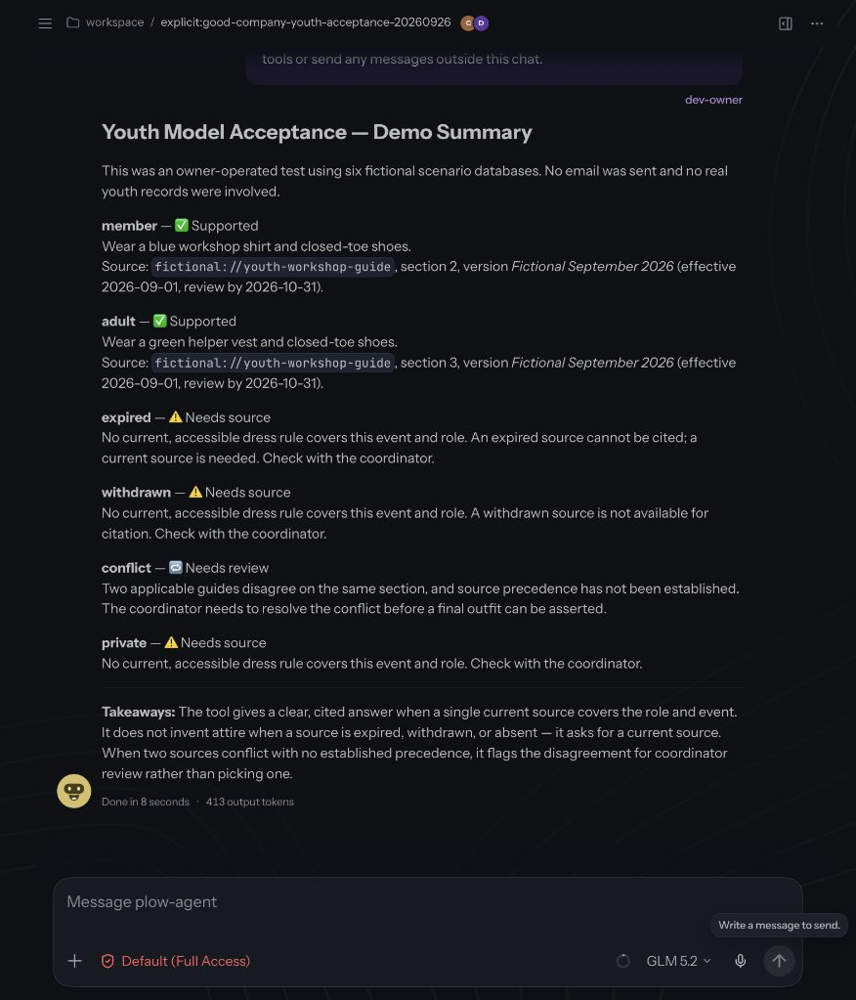

# Actual agent demo

[Play or download the 36-second video](real-agent-demo.mp4)

Captured from the running Plow/OpenClaw agent on September 26, 2026 (Los Angeles),
using GLM 5.2. These are two joined, silent browser screenshot sequences sampled
approximately once per second, preserving each sequence's sample timing. They are
not a continuous recording of an end-to-end delivery cycle. Only even-dimension
padding and video encoding were applied; the still is an unmodified browser capture.

The first segment shows the actual model summarizing six fictional attire cases
from its observed tool results: cited member/adult answers, unavailable expired or
withdrawn sources, conflicting guidance requiring review, and inaccessible private
material. The underlying model/tool evidence is in
[the youth acceptance result](../../eval/adoption/youth/model-result.json).

The second segment shows a real read-only tool call against the isolated self-test
ledger. It checks hashed receipt identities against earlier verified delivery
evidence: one event reminder, one assignment notice, two cancelled task notices,
and autonomy disabled. Addresses and raw provider receipt identifiers are excluded.
The model explicitly identifies these as historical receipts. No new email was sent,
no current inbox read occurred, and this capture does not prove unattended scheduling.
The final sentence about nothing being sent refers to this read-only recording run.

The captured runtime image and source revision are recorded in [manifest.json](manifest.json).
They identify the installed runtime, not the latest repository commit. All 32 source
frames underwent OCR text review; representative initial and completed screens also
received visual inspection. No credentials, private documents, account identities,
or real membership records were found. There is no audio track.
The MP4 passed a complete FFmpeg decode check.

These repository links require access while the repository is private. Public media
hosting and the remaining live lifecycle acceptance in #9 are still outstanding;
this artifact alone does not close #13. Private raw trajectories and source frame
files are deliberately excluded from the repository.
